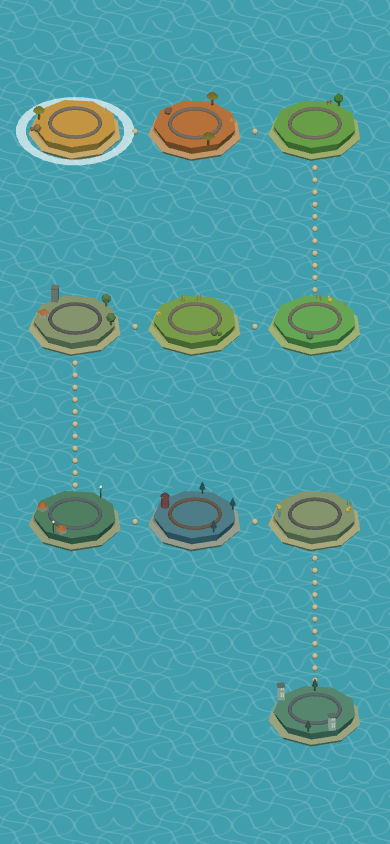
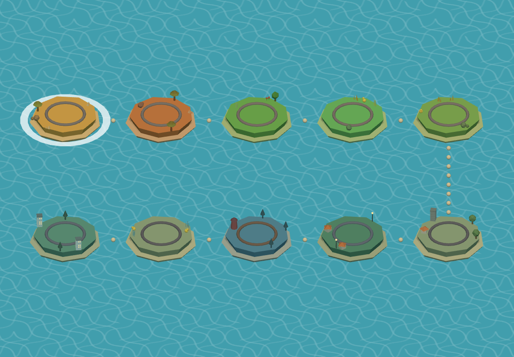
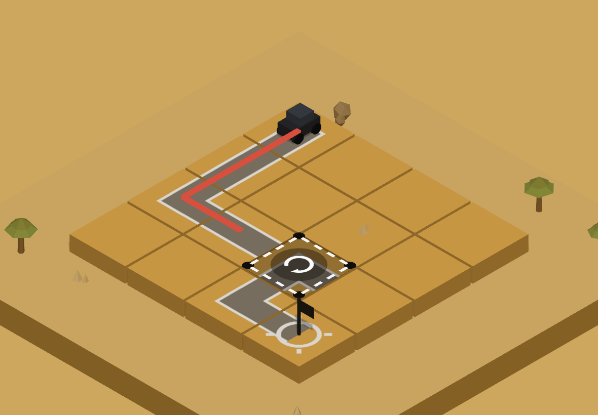
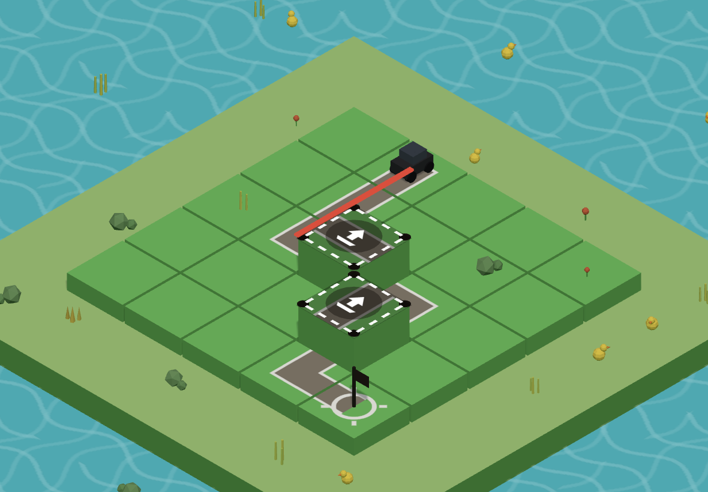
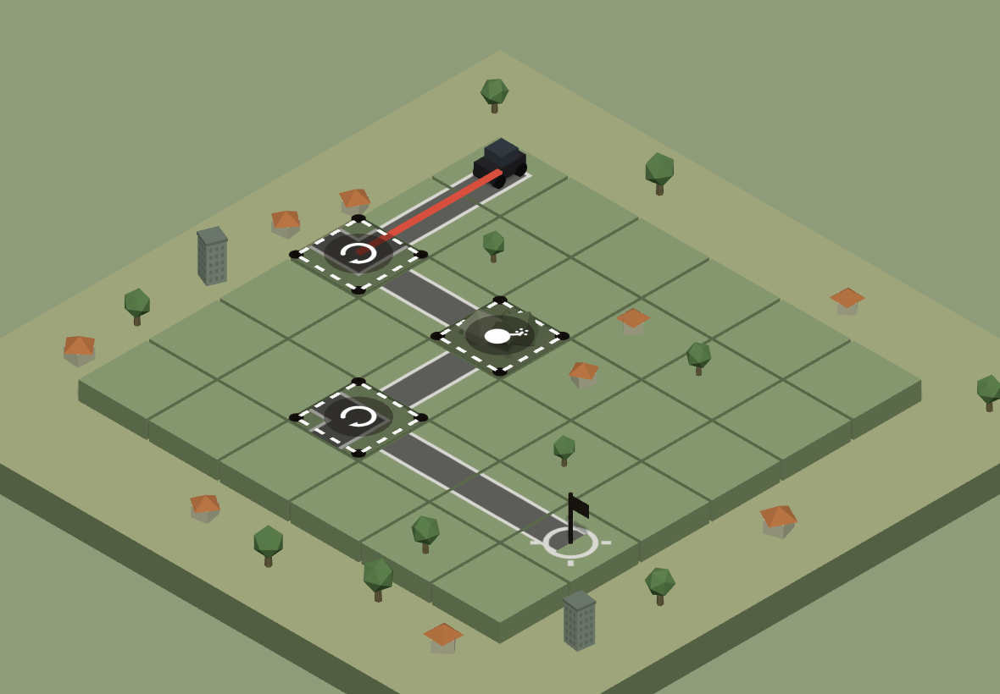
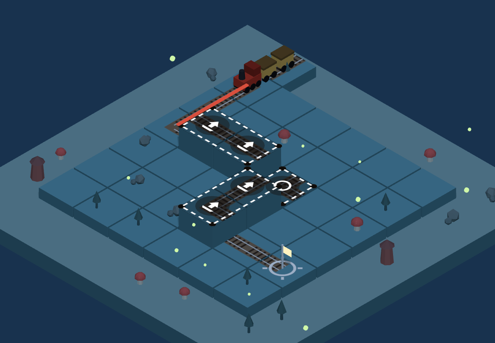
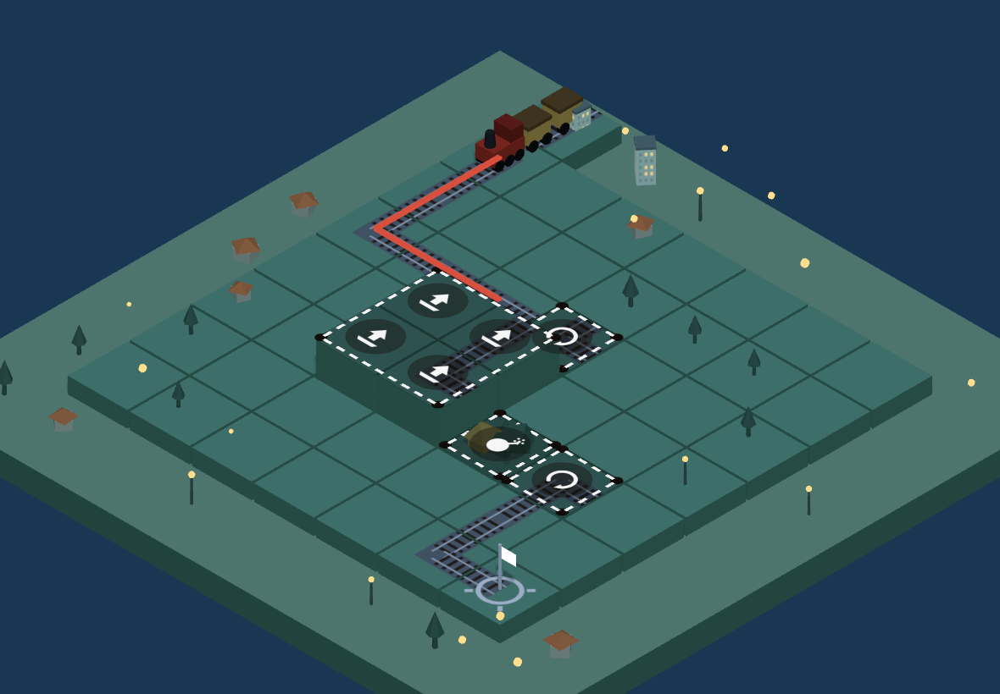

# 02. 実装報告書(M1〜M5 完了時点)

対象: `docs/01.md` の企画・実装プラン。
この文書は「プランをどう実装したか」「プランから何を変えたか」「どう動かし、どう試すか」をまとめたもの。

---

## 1. 現在の状態

| 項目 | 状態 |
| --- | --- |
| マイルストーン | M1〜M5 まで実装済み |
| 画面 | 地図・プレイの 2 画面のみ(プラン 5.5 のまま) |
| レベル | 10 面。全面が最短 1〜5 手で解ける |
| ツール | 回転 / 上げ下げ / 破壊 の 3 種 |
| 文字 | ゼロ。DOM にテキストノードが無いことを E2E で機械的に保証 |
| 外部アセット | なし。形も音もテクスチャもすべてコード生成 |
| ランタイム依存 | `three` のみ |
| ビルド | `dist/` に HTML + JS 2 チャンク(アプリ 64KB / three 486KB、gzip 計 約145KB) |
| テスト | 単体 148 件(約 0.7 秒)、E2E 45 件(約 3.2 分)。すべて緑 |

### 画面

地図(iPhone 縦 / iPad 横):




プレイ画面(ツールの種類がわかる 4 面):







---

## 2. プランからの変更点・判断一覧

プランの骨格(ツール 3 種 / 10 面 / 文字ゼロ / 2 画面 / 正射影アイソメ)は変えていない。
実装の途中で決めたこと、プランに書かれていなかったことを以下に挙げる。

### 2.1 コアロジック(M2)

| # | 判断 | 理由 |
| --- | --- | --- |
| D1 | 破壊した瓦礫の下から道が現れる仕組み(`reveal`)を追加した。レベルデータで `{ kind: 'block', reveal: { kind: 'curve', rot: 2 } }` のように書く | プラン 4.2 T3 では破壊の跡は「空地」だけだった。それだと破壊は「邪魔なものを退ける」操作にしかならず、経路を作る手応えが薄い。瓦礫の下から道が出てくると「壊す = 道が繋がる」が一目でわかる |
| D2 | 破壊ツールは「効果があったときだけ」使い切りになる | 空振りで消えると、何も起きないのにツールが減って詰んだように見えるため(プラン 4.2 T3 の意図を保つ実装上の補強) |
| D3 | 上げ下げは範囲内の最小の高さを見て一斉に上げる / 下げる | 決定事項 Q5(2 段トグル)を範囲ツールに広げたときの自然な一般化。範囲内の相対差は保たれる |
| D4 | 経路プレビュー線は「繋がっている範囲の終端」で止める | プラン 4.3 のとおり。足りない場所がそのまま見える(3.3-(5)) |

### 2.2 見た目(M3・M4)

| # | 判断 | 理由 |
| --- | --- | --- |
| D5 | 夜のテーマでも半球光を暗くしすぎない。夜らしさは空の色・発光する窓・蛍・寒色の光で出す | 実際に暗くすると 4 歳児にはタイルの向きが読めなくなった。プラン 7.1 の「明度差は大きめ(4 歳児の視認性)」を優先した |
| D6 | 橋(レベル 9)は直線タイルの上に欄干と橋げたを立てる見た目だけのバリアントにした。接続規則は直線と完全に同じ | プラン 4.1 のとおり。ルールを増やさずに水辺の絵を出せる |
| D7 | ツールアイコンの下に暗い円盤(パッド)を敷き、`depthTest` を切って必ず手前に描く | 瓦礫や模様の上でアイコンが読めなくなるのを防ぐため(7.6) |
| D8 | 列車の面では、スタートの 1 つ手前に線路タイルを 1 枚だけ置く | 待機中の列車の「尾」(客車 2 両)が盤外の空中に浮いて見えたため |
| D9 | 装飾プロップは影を落とさず、背を低くし、彩度を地面に寄せる | 触れないものを操作対象より目立たせない(3.3-(1)) |
| D10 | 同じ種類のプロップ・小道の点・紙吹雪・土煙・破片はすべて `InstancedMesh` にまとめた | R4。粒ごとにメッシュを作ると、クリアのたびに描画命令が 100 以上増える |

### 2.3 地図画面(M4・M5)

| # | 判断 | 理由 |
| --- | --- | --- |
| D11 | 島にロックをかけない。どの島でも最初からタップして入れる | 4 歳児に「まだ行けない」を文字なしで説明する手段がない。順番は島の並びと小道、そして「次の島だけが明滅する」ことで示す。詰まったら先の島で遊べるほうが手が止まらない |
| D12 | 島の配置を**画面の向きで切り替える**。横画面は 5 列 × 2 段、縦画面は 3 列 × 4 段の蛇行。向きが変わったら 0.7 秒で並べ替える | アイソメでは、ワールドの直方体を基準に収めると枠の縦横比が必ず √3 : 1 になり、縦画面では上下が大きく余って島が小さくなる(M4 時点で島の直径は約 60px しかなかった) |
| D13 | カメラのフィットを「ワールドの直方体」ではなく「画面に投影したときの広さ」で持つようにした(`render/fit.ts` の `Frame`) | D12 を実現するのに必要。島を画面座標で並べ、その並びがそのまま画面の形になる |
| D14 | 地図のフィット余白を 8% にした(盤面は 15% のまま) | 島を大きく見せるため。地図には「隣の島を覗かせる」必要がないので、プラン 5.3 の 15% は盤面にだけ適用する。結果、iPhone 縦(390×844)での島の直径は **約 84 CSS px**(M4 時点は約 60px)|
| D15 | 地図画面は一度作ったら捨てず、隠して取っておく。戻ってきたら進行の差分(旗・走る乗り物・次の島)だけを反映する | 10 島ぶんの島・装飾・水面を毎回作り直すと、戻るたびに約 1 秒フレームが詰まっていた(M4 の既知問題)。現在は地図 → プレイが約 870ms(カメラ移動 800ms + 生成 94ms)、プレイ → 地図が約 570ms |

### 2.4 操作(M5)

| # | 判断 | 理由 |
| --- | --- | --- |
| D16a | ツールの当たり判定の板を、タイルごとではなく範囲全体で 1 枚にした | 2 タイル範囲の «まんなか»(タイルの境目)がどちらの板にも入らず、押しても無反応になっていた。外周は 1 タイルの端から 0.136 タイル内側に留まるので、隣のタイルの別ツールとは重ならない |
| D16 | 盤面そのものに「何も起きない」当たり判定の板を敷いた | それまでは「ツール以外をタップ = 地図へ戻る」だったため、盤面の真ん中を触っただけで面から放り出されていた。地図へ戻るのは**盤の外(海)をタップ**したときとピンチアウトのときだけにした(5.1 / R8) |
| D17 | 瓦礫の上に載った回転ツールは、瓦礫が壊れるまで隠す(レベル 9) | 破壊ツールと回転ツールが同じマスに重なり、アイコンが 2 枚重なって当たり判定も重なっていた。壊すと現れる順序も伝わる |
| D18 | 島の当たり判定を見た目の 1.4 倍にした | 5.2。M4 では 1.3 倍だった |

### 2.5 パフォーマンス(M5)

| # | 判断 | 理由 |
| --- | --- | --- |
| D19a | 1 フレームで進める時間の上限を 0.25 秒にした(以前は 0.05 秒) | 描画が重いだけのときにアニメーションが実時間より長く伸び、「回転中は入力を受け付けない」時間が 0.25 秒のはずが 0.5 秒以上になっていた |
| D19 | 描画を 3 段階のオンデマンドにした。操作・走行・カメラ移動は 60fps、蛍と水面のゆらぎは 30fps、明滅と旗の揺れだけなら 12fps | R5(発熱・バッテリー)。動きの無いフレームは 1 枚も描かない |
| D20 | `three` を別チャンクに分けた(`build.rollupOptions.output.manualChunks`) | ビルドの chunk サイズ警告の解消と、アプリだけを直したときの再ダウンロードを減らすため |

---

## 3. ディレクトリ構成

```
/
├─ index.html              キャンバス 1 枚だけ。文字は無い
├─ vite.config.ts          base: '/260914/'、three を別チャンクに
├─ vitest.config.ts
├─ playwright.config.ts    4 ビューポート、SwiftShader で WebGL
├─ package.json
├─ tsconfig.json
├─ docs/
│   ├─ 01.md               企画・実装プラン(承認済み)
│   ├─ 02.md               本書
│   └─ pages.workflow.yml  GitHub Pages 用ワークフローの雛形
├─ src/
│   ├─ main.ts             起動。地図を 1 つ作り、プレイ画面を出し入れする
│   ├─ core/               純粋ロジック(Three.js 非依存・単体テスト対象)
│   │   ├─ types.ts        Tile / Board / Tool / Direction
│   │   ├─ board.ts        盤面の生成・複製
│   │   ├─ solve.ts        経路判定 BFS(4.3)
│   │   ├─ tools.ts        回転 / 上げ下げ / 破壊(純関数)
│   │   └─ progress.ts     localStorage の進行管理
│   ├─ levels/
│   │   ├─ schema.ts       レベルデータの型・テーマ別パレット・盤面の組み立て
│   │   ├─ index.ts        10 面の一覧
│   │   └─ level01.ts 〜 level10.ts
│   ├─ render/
│   │   ├─ scene.ts        レンダラ・ライト・カメラ・オンデマンド描画
│   │   ├─ fit.ts          投影後の広さで持つ枠(Frame)と縦横フィット(5.3)
│   │   ├─ tileMesh.ts     タイルのスラブ(厚み・側面・上面テクスチャ)
│   │   ├─ overlay.ts      ツールの範囲表示・アイコン・当たり判定の板
│   │   ├─ pathLine.ts     経路プレビュー線と光の流れ
│   │   ├─ props.ts        木・家・塔・アヒル・蛍などの生成(InstancedMesh)
│   │   ├─ vehicle.ts      車・列車と走行
│   │   ├─ textures.ts     CanvasTexture(白線・横断歩道・アイコン・水面)
│   │   └─ fx.ts           紙吹雪・土煙・破片(InstancedMesh)
│   ├─ audio/
│   │   ├─ context.ts      AudioContext の初期化と resume(R1 / R2)
│   │   ├─ sfx.ts          効果音の合成
│   │   └─ bgm.ts          BGM の合成とループ
│   ├─ input/
│   │   └─ touch.ts        pointer イベント → Raycaster → ツール発動(5.1 / 5.2)
│   └─ screens/
│       ├─ map.ts          地図(島 10 個。持続、隠して取っておく)
│       └─ play.ts         盤面プレイ
├─ tests/                  Vitest
│   ├─ solve.test.ts       経路判定
│   ├─ tools.test.ts       3 ツールの純関数
│   ├─ levels.test.ts      全 10 面の可解性・手数・当たり判定の重なり
│   ├─ touch.test.ts       誤タッチ耐性(端・ぶれ・2 本指・連打)
│   └─ audio.test.ts       音合成のパラメータ
└─ e2e/                    Playwright
    ├─ screenshots.spec.ts 4 ビューポート / 全 10 面クリア / 文字ゼロ / 遷移時間
    └─ screenshots/        撮影した PNG(本書が参照している)
```

---

## 4. 起動・テスト・ビルド

```bash
npm ci          # 依存の取得(three + 開発用のみ)
npm run dev     # 開発サーバ。http://localhost:5173/260914/
npm test        # 単体テスト(Vitest)
npm run e2e     # E2E(Playwright)。ビルドしてプレビューを立て、自動で撮影・操作する
npm run build   # 本番ビルド → dist/
npm run typecheck
```

補足:

- `npm run dev` の URL は `base` の影響で `/260914/` 配下になる。
- デバッグ用に URL クエリを 2 つだけ見る。プレイヤーには一切見えない。
  - `?level=N` … N 面のプレイ画面から始める
  - `?debug=1` … `window.__game` に読み取り口を出す(E2E のタップ位置計算用)
- `npm run e2e` は Playwright が `npm run build && npm run preview` を自分で起動する。
- 実機(iPhone / iPad)で試すときは `npm run dev -- --host` として、同じ Wi‑Fi から
  `http://<PC の IP>:5173/260914/` を Safari で開く。音は最初のタップから鳴る(R1)。

---

## 5. GitHub Pages への公開

1. 雛形をワークフローとして配置する。

   ```bash
   mkdir -p .github/workflows
   cp docs/pages.workflow.yml .github/workflows/pages.yml
   git add .github/workflows/pages.yml && git commit -m "ci: GitHub Pages への公開" && git push
   ```

2. GitHub のリポジトリ設定 → **Pages** → **Source** を **GitHub Actions** にする。
3. `main` へ push すると、`npm ci` → `typecheck` → `test` → `build` が走り、`dist/` が公開される。
4. 公開 URL は `https://<ユーザー名>.github.io/260914/`。
   `vite.config.ts` の `base` が `/260914/` なのは、この階層に置かれるため。
   リポジトリ名を変えたら `base` も必ず合わせる(R10)。

Service Worker と PWA マニフェストは置かない(プラン 8.5)。

---

## 6. 実機で 4 歳児に試すときのチェックリスト

観察するのは「できたかどうか」ではなく「**どこで手が止まったか**」。声をかけずに見る。

### 6.1 最初の 5 分

- [ ] 起動して最初に地図が出たとき、**明滅している島**に自分から手が伸びるか。
- [ ] 島をタップして中に入れるか(1 回で入れるか、何度も押しているか)。
- [ ] レベル 1 で、**説明なしに**光っているツールを押せるか。
- [ ] 押したあと「回った」ことに気づくか。顔が上がるか。
- [ ] 道が繋がって車が走り出したとき、笑うか / 指をさすか。

### 6.2 戻り方の発見

- [ ] 面をやめたくなったとき、**自分で地図へ戻れるか**。
  - 戻り方は 2 つ(2 本指で広げる / 盤の外の海をタップ)。どちらを先に見つけたか記録する。
  - 見つけられずに固まったら、そこがいちばん直すべき場所。
- [ ] クリア後、2 秒待つと自動で地図へ戻る。これに驚いていないか。

### 6.3 地図での迷子

- [ ] クリア後の地図で、**次に遊ぶ島**を見つけられるか(明滅と旗が手がかり)。
- [ ] 縦持ち・横持ちを切り替えたとき、並べ替えについて行けるか。
- [ ] 遠い島(10 番目)をタップしてしまったとき、戻ってこられるか。

### 6.4 誤タッチと持ち方

- [ ] 端末の端を握った手のひらで操作が暴発していないか(端 16px は無視している)。
- [ ] タップのつもりで指がずれて、反応しないことが続いていないか(12px まで許容)。
- [ ] 連打したとき、回転が飛ばされたり二重に回ったりしていないか。
- [ ] ノッチ / ホームインジケータの上にツールが来ていないか(縦横とも)。

### 6.5 音

- [ ] 端末のサイレントスイッチが入っていないか(iOS では Web Audio も無音になる)。
- [ ] 最初のタップで BGM が鳴り始めるか。
- [ ] 音量が大きすぎないか。**音量は端末の物理ボタンでのみ調整する**(アプリ内に設定は無い)。
- [ ] ホームに戻って復帰したあと、音が戻るか。

### 6.6 記録のしかた

面ごとに「自力クリア / ヒント演出のあとクリア / 詰まって離脱」の 3 段階で記録し、
詰まった面はその場で何をしていたか(どこを押していたか)を書き留める。
M5 の完了条件は「ひとりで少なくとも 5 面をクリアできる」。

---

## 7. 既知の問題と今後の候補

### 7.1 既知の問題

| # | 内容 | 影響 |
| --- | --- | --- |
| K1 | 紙吹雪・土煙は粒ごとの濃さを持てず、群れ全体でまとめて薄くなる(`InstancedMesh` にした代償) | ほぼ同時に生まれて同時に消えるので見た目の差は出ないが、厳密には一斉にフェードする |
| K2 | 地図画面は隠しても WebGL コンテキストを保持し続ける | プレイ中はコンテキストが 2 つになる。ループは止めているので描画負荷は無いが、メモリは載ったまま |
| K3 | 実機(iPhone / iPad)での 60fps と発熱は未検証。検証はヘッドレス Chromium(SwiftShader)で行っている | 実機での確認が必要 |
| K4 | 4 歳児による実プレイテストが未実施 | M5 の完了条件のうち、ここだけが残っている |
| K5 | 進行状況を消す手段が UI に無い(意図的、4.5) | 最初からやり直したいときは開発者ツールから `localStorage` を消すしかない |
| K6 | 画面の向きを変えたときの並べ替え中(0.7 秒)にタップすると、動いている島を押すことになる | 押した島に入れるので実害は小さい |

### 7.2 今後の候補

- 実機テストの結果を見て、レベル 6〜10 の手数をさらに削る(現在の最短手数は 1, 3, 3, 2, 2, 4, 4, 4, 5, 5)。
- ヒント演出の頻度(現在は 6 秒無操作)を、年齢や面ごとに変える。
- 島に入るときのカメラ移動を、地図で押した島の位置から始める演出にする(現在も寄るが、もっと繋がって見せられる)。
- 未決事項 Q7(テストの回数)と Q8(破壊後のリセット手段)は実機テスト後に再検討する。
- 音の種類を面ごとにもう少し変える(現在はテーマごとに BGM のキーと音色だけ変えている)。

---

## 8. テストで守っていること

| 種別 | 内容 |
| --- | --- |
| Vitest | 経路判定(繋がる / 繋がらない / 段差 / レイヤー違い) |
| Vitest | 3 ツールの純関数(回転 4 回で元通り、上下のトグル、破壊は `block` にのみ効く) |
| Vitest | 全 10 面が解け、初期状態では解けていないこと。最短手数が 6 以下 |
| Vitest | 同じマスに「同時に触れる」ツールが 2 つ載っていないこと。当たり判定の板が隣と重ならないこと |
| Vitest | 誤タッチ耐性(画面端 16px、12px のぶれ、2 本目の指、pointercancel、連打) |
| Playwright | 4 ビューポートのスクリーンショット(iPhone 縦横 / iPad 縦横) |
| Playwright | **全 10 面を実際にタップしてクリアする**(描画・当たり判定・入力・走行の通し確認) |
| Playwright | 地図・プレイの両方で、DOM にテキストノードが 1 つも無いこと |
| Playwright | iPhone 縦の地図で島の直径が 72 CSS px 以上あること |
| Playwright | 地図 → 島 → 地図 の遷移がカメラ移動 0.8 秒 + 0.2 秒に収まること |
| Playwright | 盤面のタイルを触っても面から出ないこと、画面端のタップが無視されること |

以上。
